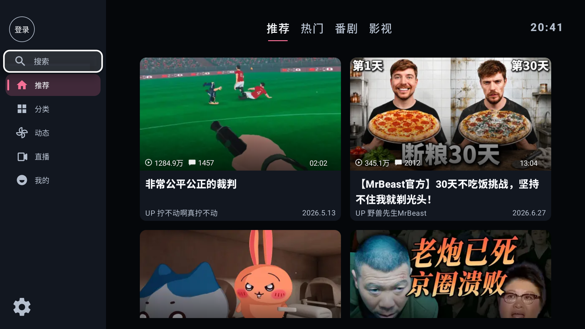
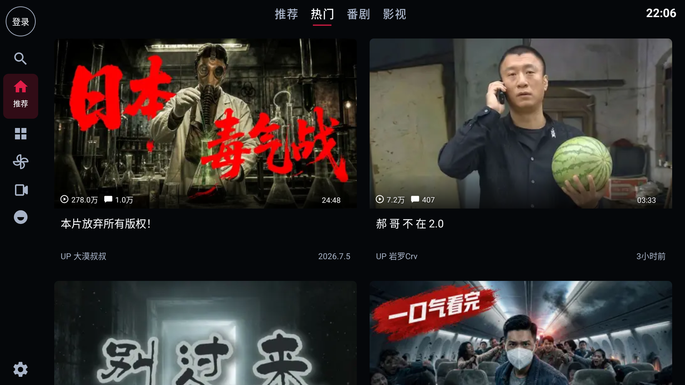
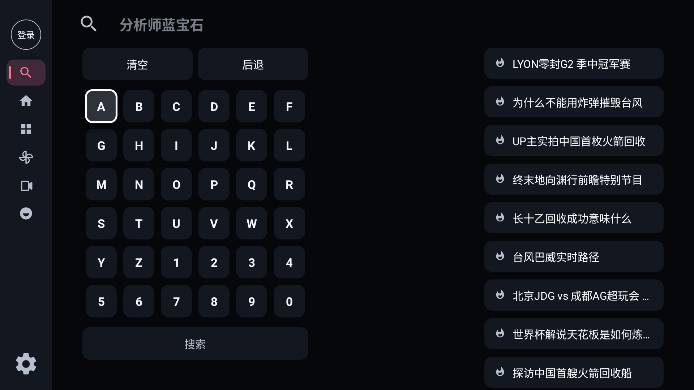
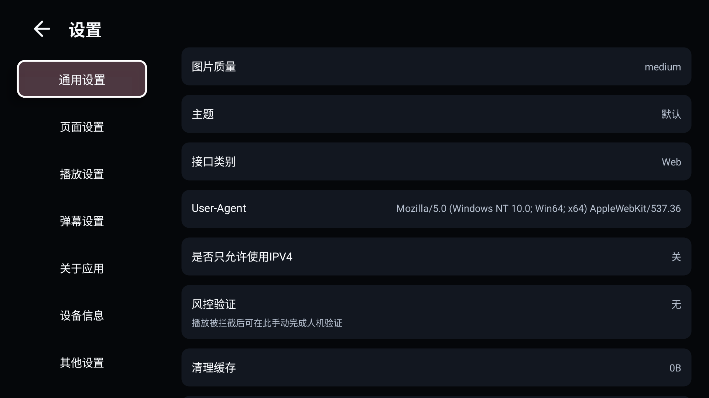

# Bili

Bili 是一个面向 Android TV / Google TV 的第三方 Bilibili 客户端，基于 [cat3399/blbl](https://github.com/cat3399/blbl) 二次开发。

这个分支的目标很明确：让电视上看视频这件事更顺手。界面更疏朗，焦点更清楚，播放页更干净，默认画质也更偏向电视场景。

## 当前版本重点

- 首页和普通视频列表默认使用 2 列大卡片，番剧海报默认 4 列，直播默认 3 列。
- 搜索键盘、动态关注栏、我的页面、详情页和设置页统一使用电视安全区与大字号。
- 侧栏区分当前栏目和遥控器焦点，卡片使用放大、亮面、描边与阴影组合反馈。
- 播放默认偏向最高画质，优先 HDR，其次 4K 和更高码率。
- 默认关闭弹幕，并隐藏播放器里的弹幕按钮，减少播放时的干扰。
- 播放页支持遥控器方向下键切换下一个视频，接近短视频连续浏览体验。
- 统一影院式暗色 UI、焦点动画、卡片间距、弹窗、登录页、启动图和应用图标。
- 应用显示名调整为 `BLBL TV`。

## 界面预览

**应用图标**


**电视首页**



**热门页**



**番剧页**


**影视页**


**搜索页**



**设置页**



**二维码登录**


**播放器**


**方向下键切换下一个视频**


## 安装

当前可以自行构建调试包，或在本地生成 APK 后通过 ADB 安装到电视：

```sh
adb install -r app/build/outputs/apk/debug/app-debug.apk
```

如果你使用的是电视盒子或真机电视，需要先打开开发者模式，并允许 ADB 调试或未知来源安装。

## 构建

环境要求：

- JDK 17
- Android SDK，`compileSdk` 为 36
- Gradle Wrapper 使用仓库内置的 `./gradlew`

构建调试包：

```sh
./gradlew :app:assembleDebug
```

运行单元测试与静态检查：

```sh
./gradlew :app:testDebugUnitTest :app:lintDebug :app:assembleDebug
```

构建发布包：

```sh
./gradlew :app:assembleRelease
```

发布包需要配置签名信息。支持通过 Gradle 参数或环境变量提供：

- `RELEASE_STORE_PASSWORD`
- `RELEASE_KEY_ALIAS`
- `RELEASE_KEY_PASSWORD`

可选版本参数：

```sh
./gradlew :app:assembleRelease -PversionName=0.1.1 -PversionCode=2
```

## 开发说明

本仓库以 `Rito-w/bili` 作为主仓库，原项目保留为上游：

```sh
git remote -v
```

同步上游时建议先检查差异，再按需合并：

```sh
git fetch upstream
git diff main upstream/main
```

## 技术栈

- Kotlin
- AndroidX / AppCompat / Material
- RecyclerView / ViewPager2 / ViewBinding
- Media3 ExoPlayer
- IjkPlayer 插件支持
- OkHttp
- Protobuf-lite / gRPC lite

## 路线图

- 在更多电视品牌和遥控器上补充真机兼容性测试。
- 继续优化弱网、接口异常和空数据状态。
- 整理正式发布流程和 Release APK。

## 上游与致谢

本项目基于 [cat3399/blbl](https://github.com/cat3399/blbl) 二次开发。感谢原项目和相关开源社区提供的基础工作。

也感谢以下项目和资料：

- [SocialSisterYi/bilibili-API-collect](https://github.com/SocialSisterYi/bilibili-API-collect)
- [xiaye13579/BBLL](https://github.com/xiaye13579/BBLL)
- [bggRGjQaUbCoE/PiliPlus](https://github.com/bggRGjQaUbCoE/PiliPlus)
- [debugly/ijkplayer](https://github.com/debugly/ijkplayer)

## 免责声明

本项目为第三方客户端，仅用于学习、研究和个人使用，与哔哩哔哩官方无关。

请勿将本项目用于任何违法、侵权、商业牟利或干扰平台正常运营的行为。使用本项目产生的风险由使用者自行承担。
